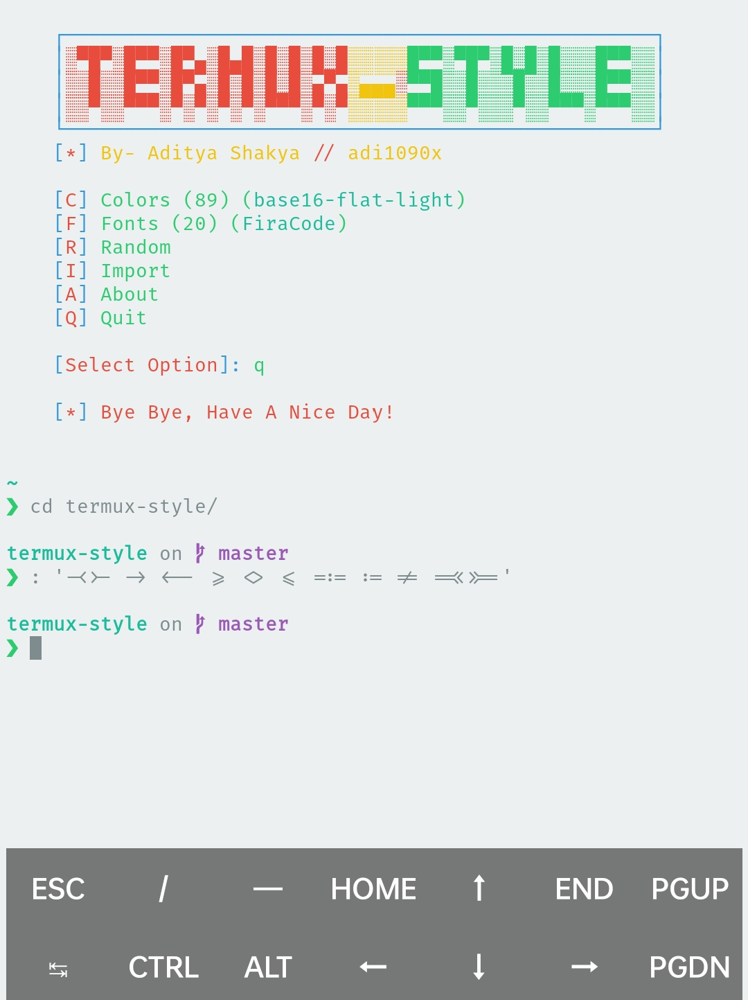
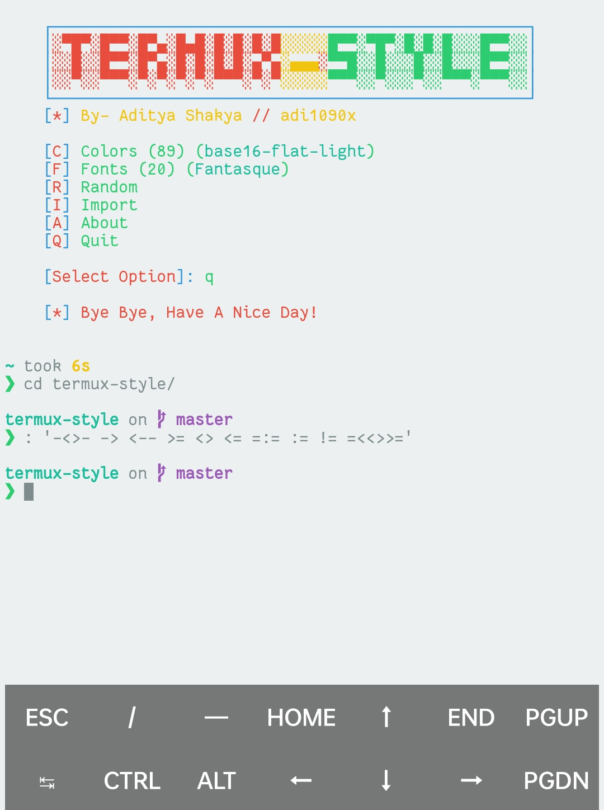
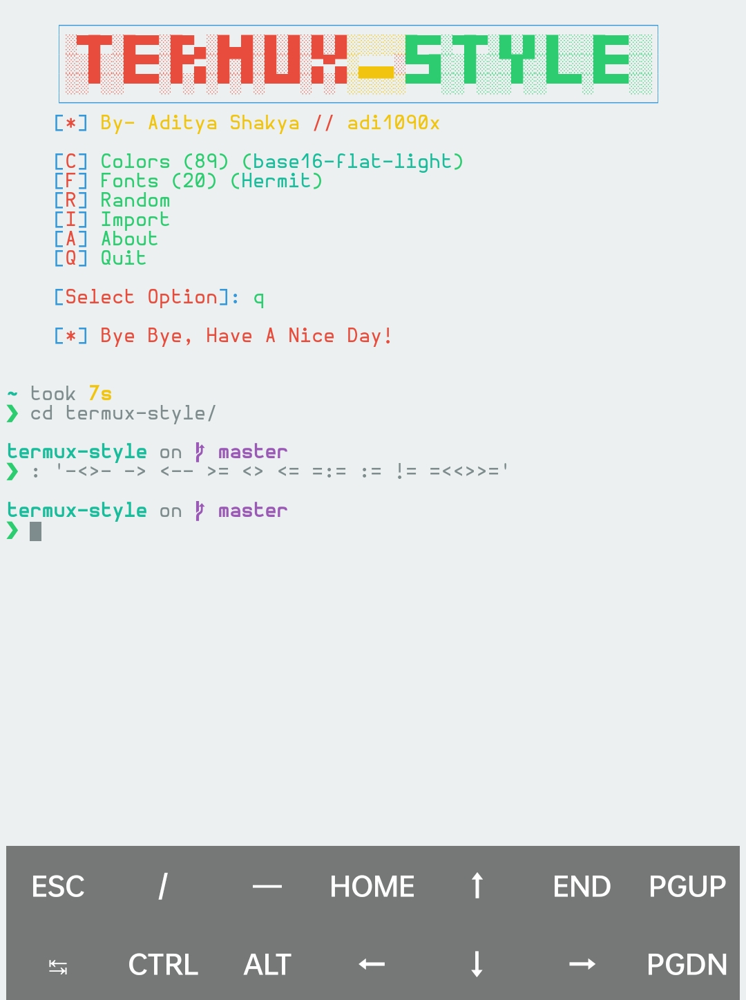
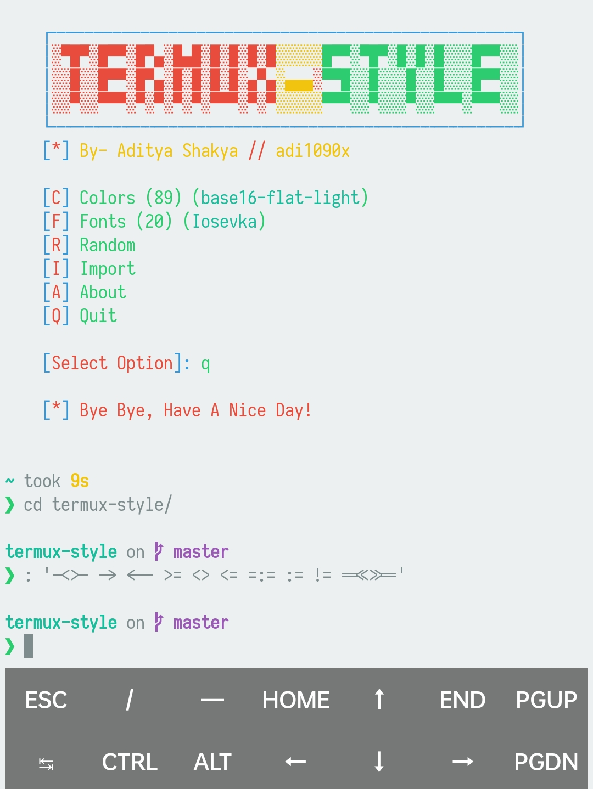
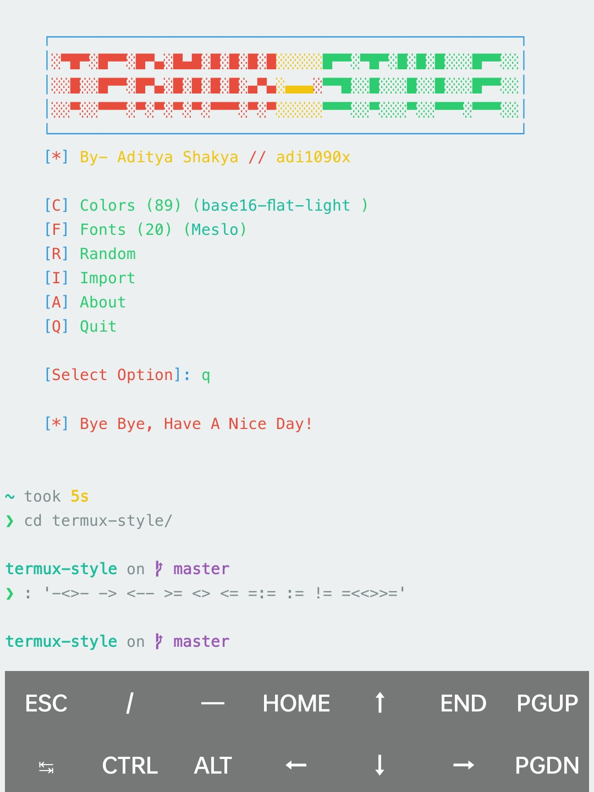
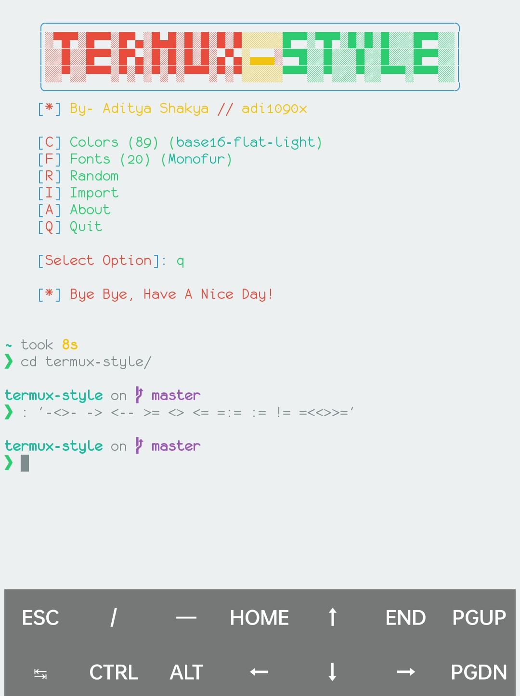
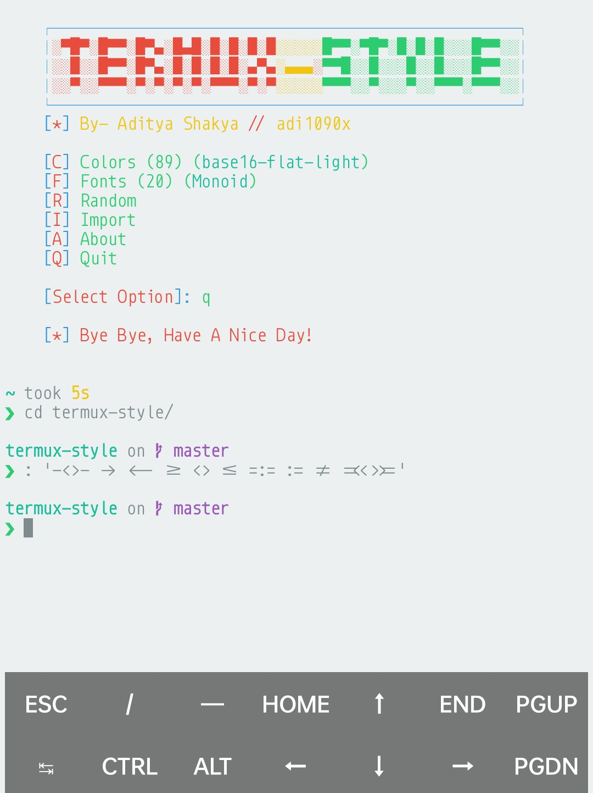
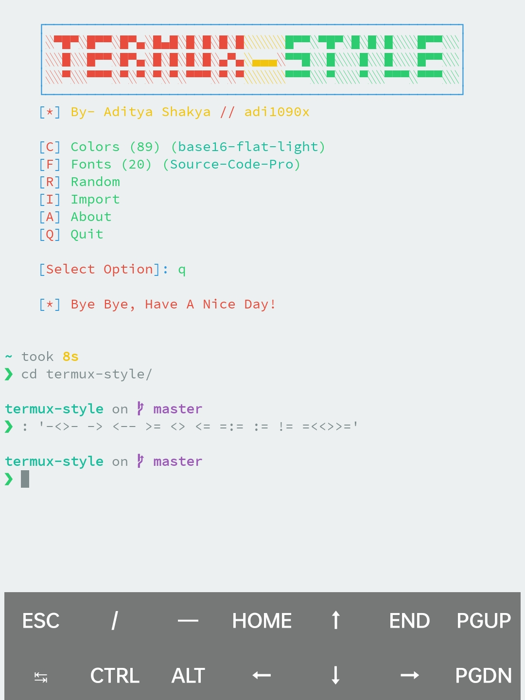
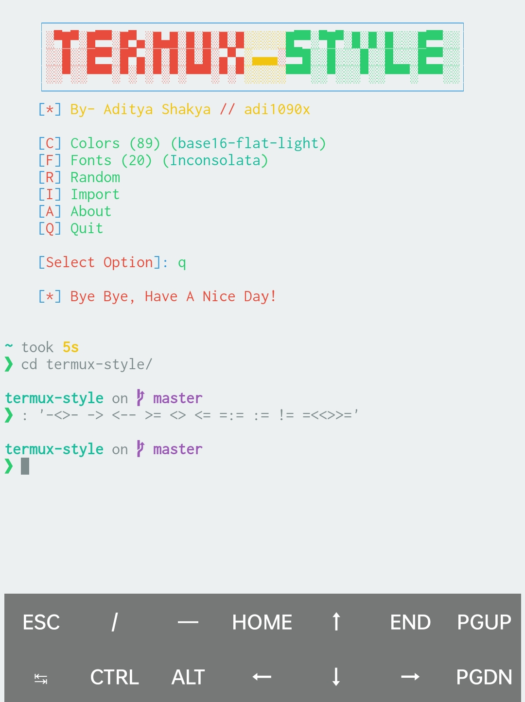

## 界面

我使用星船 🚀

~~~ sh
echo $'\n''eval "$(starship init bash)"'$'\n' | tee -a -- ~/.bashrc
exec bash
~~~

## 色彩和字体

我用这个：[adi1090x/termux-style](https://github.com/adi1090x/termux-style)

安装它会安一大堆软件。

我看到有一些貌似问我要不要更新还是保留原样的提示，我选择了非默认的 `Y` 让它更新。

安好就可以用了，命令见安装完成后的提示。

这是我的配置：

验证字体看看：

可以看到这是 Nerd 字体。

完成！

另外这个东西貌似也可以加入自己的字体——

……我没试过，我不知道那个 `Import` 到底是不是我理解的那样……😓😜

## 部分字体比对

